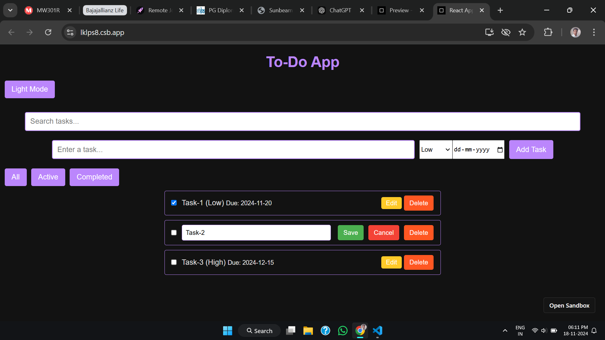
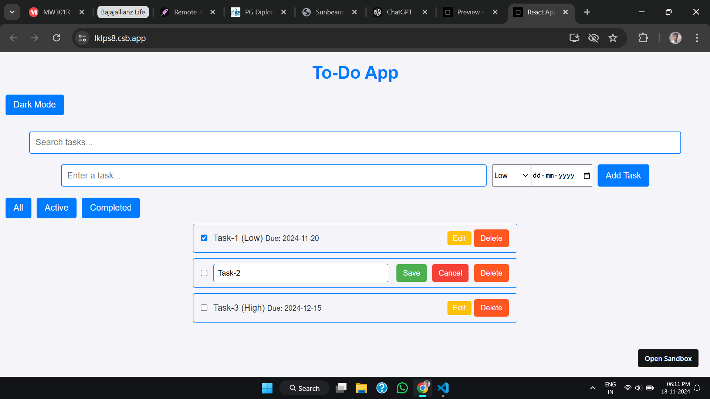

# 🌟 To-Do App

A sleek and modern To-Do Application built with React, designed to help you stay organized, productive, and focused. With support for dark mode, task prioritization, and due dates, this app ensures you never miss a deadline.

---

## ✨ Features

- Add Tasks: Add tasks with a name, priority, and optional due date.
- Edit Tasks: Update task names and details seamlessly.
- Delete Tasks: Remove tasks you no longer need.
- Mark as Completed: Check off tasks when they're done.
- Filter Tasks: View tasks by their status: All, Active, or Completed.
- Search Functionality: Quickly find tasks with a built-in search bar.
- Dark Mode: Switch between light and dark themes for a better user experience.
- Responsive Design: Fully optimized for mobile, tablet, and desktop screens.
- Prioritization: Assign priorities like Low, Medium, and High for tasks.

---

## 📸 Screenshots

|                         Dark View                         |                         Light View                          |
| :-------------------------------------------------------: | :---------------------------------------------------------: |
|  |  |

---

## 🚀 Live Demo

Check out the live version of the app on [Netlify](https://react-todo-app-345.netlify.app/).

---

## 🛠️ Technologies Used

- Frontend: React.js
- Styling: CSS with custom dark mode support
- State Management: React Hooks (useState, useEffect)

---

## 📖 How to Run Locally

1. Clone the repository:

   ```bash
   git clone https://github.com/deepakpatil26/todo-app.git
   cd todo-app
   ```

2. Install dependencies:

   ```bash
   npm install
   ```

3. Start the development server:

   ```bash
   npm start
   ```

4. Open the app: Visit [http://localhost:3000](http://localhost:3000) in your browser.

---

## 📂 Project Structure

```javascript

├── public
│ └── index.html
├── src
│ ├── components
│ │ ├── FilterButtons.js
│ │ ├── TodoInput.js
│ │ ├── TodoItem.js
│ │ └── TodoList.js
│ ├── App.css
│ ├── App.js
│ └── index.js
└── package.json
```

---

## 🌈 Contributing

Contributions are welcome! If you find bugs or have suggestions for new features:

1. Fork the repository.
2. Create a new branch.
3. Commit your changes and submit a pull request.

---

## 📝 License

This project is licensed under the MIT License. You are free to use, modify, and distribute it as you see fit.

---

## 📧 Contact

If you have any questions or feedback, feel free to reach out at [deepakpatil2612@gmail.com](mailto:deepakpatil2612@gmail.com)

---

🌟 Like this project? Don’t forget to give it a star! 🌟
